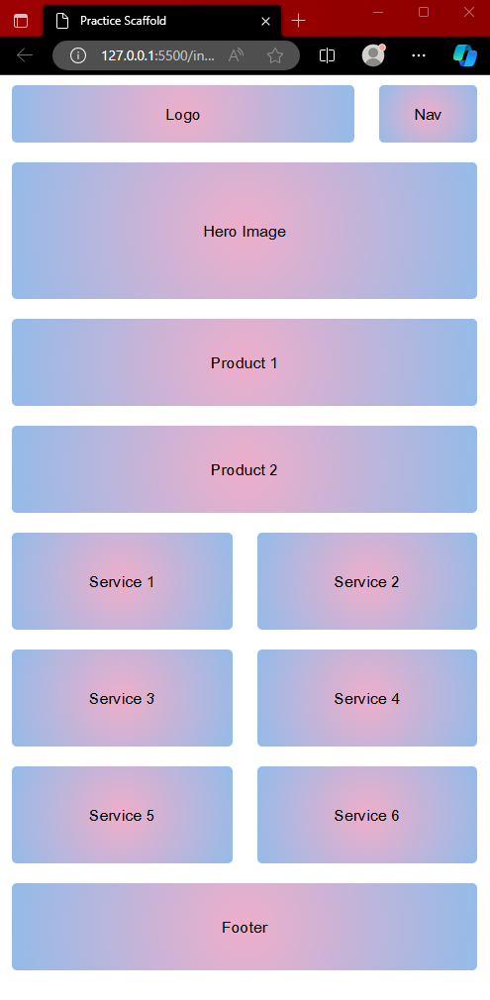
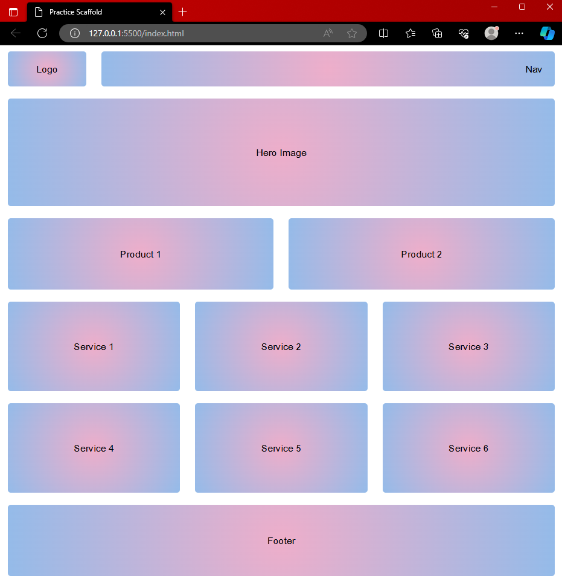
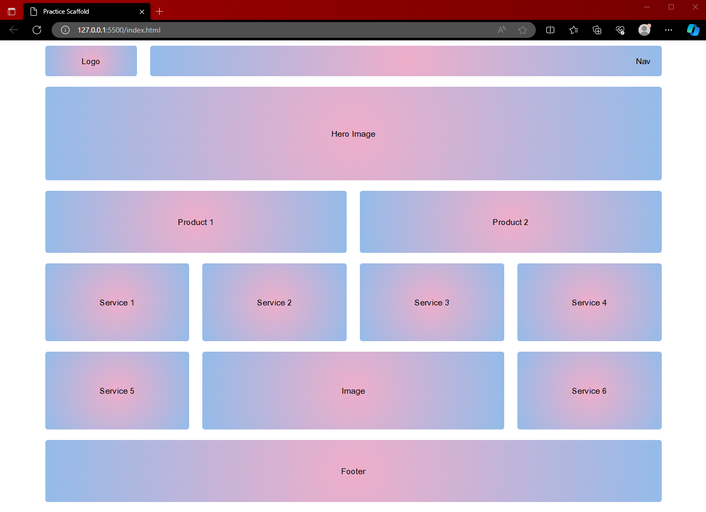

# Gohetia_Sheldon_Project2-main.zip

This repo is for the Homework 2 - Practice Scaffold

## Output Screenshots

### Mobile

### Tablet

### Desktop

## Installation

No installation is required.

## Usage

Open the index file in your browser of choice.

## History

No history is required

## Credits

Sheldon Gohetia

## License

MIT - see license file for more information.
